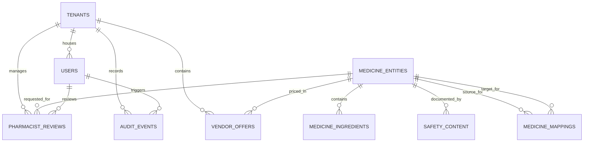

# AltMedi Long-Term Project Memory

This file serves as the definitive, persistent memory bank for the **AltMedi** codebase. It documents the project background, architectural state, completed features, data models, business rules, and technical roadmap.

---

## 1. Project Overview

- **Product Name**: AltMedi (Nashik Pilot Edition)
- **Tagline**: Production-grade medicine comparison and medication decision-support platform for India.
- **Mission**: Drastically reduce out-of-pocket healthcare expenses for Indian households by presenting verified bioequivalent generic medicines (e.g., Jan Aushadhi and high-volume Indian generics), showing real-time street prices at nearby local pharmacies, and ensuring patient safety through strict clinical governance and human-in-the-loop pharmacist verification.
- **Target Geography**: Pilot launching in **Nashik, Maharashtra** (`pilot-nashik-01`), covering key localities such as College Road, Canada Corner, Nashik Road, Panchavati, Gangapur Road, and Indira Nagar.
- **Key Personas**:
  1. **Patients & Caregivers**: Need instant translation of handwritten doctor slips into affordable generic options, verified local availability, and reservation locks.
  2. **Pharmacists (Chemists)**: Need a legal, compliant substitution queue with license verification to validate bioequivalent dispensing under the Drugs and Cosmetics Act.
  3. **Prescribers (Doctors)**: Need visibility into price variations and bioequivalent formulations to optimize prescription compliance without compromising clinical efficacy.
  4. **Retail Pharmacy Vendors**: Need an inventory and price update portal to publish live stock, manage MRP discounts, and prevent walk-away customers.
  5. **Healthcare / District Admins**: Need tenant management, catalog governance, and immutable clinical audit trails for regulatory compliance.

---

## 2. Tech Stack

| Layer | Technology | Version | Purpose |
| :--- | :--- | :--- | :--- |
| **Frontend UI** | React | `^19.0.1` | Component-based interactive view layer |
| **Language** | TypeScript | `~5.8.2` | Full static type safety across data and UI |
| **Build Tooling** | Vite | `^6.2.3` | Ultra-fast HMR and ESM bundling |
| **CSS / Styling** | Tailwind CSS (Vite Plugin) | `^4.1.14` | Modern zero-runtime utility styling system |
| **Icons** | Lucide React | `^0.546.0` | Comprehensive medical, navigational, and UI icons |
| **Animations** | Motion (Framer Motion) | `^12.23.24` | Smooth transitions, sheet modals, and micro-interactions |
| **AI / Multimodal** | `@google/genai` (Gemini API) | `^2.4.0` | Server-side multimodal handwriting OCR & extraction |
| **Backend / Runtime** | Express + TSX (Node.js) | `^4.21.2` | REST API process and runtime support |
| **ORM / Database Schema** | Prisma + PostgreSQL | `^6.16.0` | Validated relational schema and generated database client |
| **Environment Config** | Dotenv | `^17.2.3` | Environment variable management |
| **Session Storage** | HTML5 LocalStorage | Browser Native | Persistence for `altmedi_auth_session` |

---

## 3. Features Completed

### 3.1 Patient Mobile Experience (`src/components/patient/`)
- [x] **Constrained Mobile Viewport Container**: Dedicated `max-w-md` shell simulating modern native mobile ergonomics.
- [x] **Prescription Camera & Simulated OCR (`PrescriptionCamera.tsx`)**:
  - Live video stream simulation with viewfinder reticle, grid guidelines, and capture animation.
  - Quick-sample prescription selectors (Antibiotic course, Gastroenterology slip, Pediatric fever slip).
- [x] **Prescription Item Extraction & Disambiguation (`ExtractionReview.tsx`)**:
  - Confidence scoring per item (e.g., 96% for Augmentin, 78% for Paracetamol).
  - Ambiguity handling (`isAmbiguous: true`) allowing users to pick between multiple candidate matches (e.g., Calpol 650 vs Dolo 650).
  - Dosage and frequency extraction display (e.g., *1 tab twice daily after meals*).
- [x] **Comprehensive Medicine Comparison Engine (`MedicineComparisonView.tsx`)**:
  - **Two-tier alternative grouping**: Strict separation between *Same Active Ingredient* (Bioequivalent) and *Therapeutic Alternatives*.
  - **Savings Calculation Card**: Immediate computation of percentage savings (up to 75%+) and annual cost savings in ₹.
  - **Active Ingredients Breakdown**: Side-by-side comparison of API molecules, strengths, and dosage forms.
  - **Local Nashik Pharmacy Inventory**: Real-time stock indicators, distance in km, operating hours, 24-hour tags, and chemist phone links.
  - **Inventory Freshness & Stale Badging**: Clear demarcation of verified fresh stock vs stale offers (>7 days).
  - **Interactive Stock Reservation**: Instant reservation modal with confirmation code and pharmacy contact details.
  - **Comprehensive Safety Monograph**: Tabbed view of side effects, rare severe warnings, allergy cross-reactivity, and pregnancy advisories.
  - **Sorting & Filtering**: Dynamic filtering by *Same Generic Only*, *Price: Low to High*, and *Distance: Nearest First*.
- [x] **Pharmacist Review Escalation Modal (`PharmacistReviewModal.tsx`)**:
  - 1-click review submission with urgency rating (*Routine* vs *Urgent*), patient masking, and notes.

### 3.2 Authoritative Desktop Portal (`src/components/portal/DesktopAuthoritativePortal.tsx`)
- [x] **Multi-Role Tabbed Workspace**: Widescreen (`max-w-7xl`) clinical operations portal.
- [x] **Pharmacist Queue**: Tabular review of patient substitution requests with side-by-side medicine comparison and mandatory clinical rationale recording.
- [x] **Doctor Prescriber Workspace**: Clinical formulary reference, bioequivalence monograph explorer, and local price variance analyzer.
- [x] **Vendor / Chemist Inventory Manager**: Live price and stock editor for Augmentin and core catalog medicines with immediate audit logging.
- [x] **Super Admin Mapping Governance**: Approval, quarantining, and deprecation controls for drug equivalence mappings.
- [x] **Immutable Clinical Audit Log Viewer**: Complete inspection table showing timestamp, actor, role, old value, new value, and regulatory reason.

### 3.3 Authentication & Role Management (`src/components/auth/`, `src/services/authService.ts`)
- [x] **Unified Modal & Screen Auth Experience (`AuthScreen.tsx`)**:
  - Login, Registration, Demo Quick-Switch, and Guest Mode.
  - Pre-seeded, verified demo accounts for all 6 roles: Patient, Pharmacist, Doctor, Vendor, Tenant Admin, Platform Admin.
  - Role-specific profile collection: ABHA Health ID, known allergies, Medical Council registration number (MMC/NMC), State Pharmacy Council license, and Drug License (Form 20B/21B).
  - Session persistence via `localStorage` (`altmedi_auth_session`).
- [x] **Adaptive Header (`src/components/layout/Header.tsx`)**:
  - Active user chip, verified role indicator, instant role switcher, and sign-out button.
  - Guest mode banner with call-to-action to sign in or register.

### 3.4 Production Backend & Database (`server/`, `prisma/`)
- [x] **PostgreSQL & Prisma Schema**: 9-table schema synced to Supabase PostgreSQL database with foreign key constraints, indexes, and full relational integrity.
- [x] **Automated Database Seeding (`prisma/seed.ts`)**: Populates default tenants, 6 demo users with hashed credentials, medicines, ingredients, clinical mappings, safety content, chemist offers, reviews, and audit trails.
- [x] **Modular Express REST API Layer (`server/routes/`)**:
  - `auth.routes.ts`: `/api/v1/auth/login`, `/register`, `/me` with HMAC-SHA256 tokens and role verification.
  - `medicines.routes.ts`: `/api/v1/medicines/search`, `/:id`, `/:id/alternatives`, `/:id/safety` with two-tier alternative computation.
  - `vendors.routes.ts`: `/api/v1/vendors/:medicineId/offers`, `/offers/:offerId` (price/stock updates + audit write).
  - `reviews.routes.ts`: `/api/v1/reviews/request`, `/queue`, `/:id/decision` (decision recording + audit write).
  - `governance.routes.ts`: `/api/v1/governance/mappings`, `/mappings/:id`, `/audit-logs`.
  - `prescriptions.routes.ts`: `/api/v1/prescriptions/extract`.
- [x] **Frontend Network Layer Migration**: `AltMediService` and `authService` communicate with `/api/v1/...` with resilient fallback to local state if offline.
- [x] **Immutable Clinical Audit Trail**: Append-only audit events table recording actor, action, previous value, new value, and clinical rationale.

### 3.5 Phase 5: Live AI Pipeline & Integrations (In Progress)

Phase 5 implementation is **partially complete**. The server-side services and client-side integrations have been scaffolded and wired together. The following sub-features are implemented:

#### 3.5.1 Gemini Multimodal OCR Service (`server/services/geminiService.ts`) — ✅ Created
- [x] Server-side `@google/genai` Gemini 2.0 Flash integration with multimodal image input.
- [x] Indian prescription-specific prompt engineering for messy cursive handwriting.
- [x] Structured JSON output parsing: medicine name, strength, dosage form, frequency, duration.
- [x] Confidence scoring with ambiguity flagging below 0.85 threshold.
- [x] REST endpoint wired at `/api/v1/prescriptions/extract` (`server/routes/prescriptions.routes.ts`).
- [ ] **TODO**: End-to-end test with a real handwritten prescription image.
- [ ] **TODO**: Entity resolution against canonical `medicine_entities` database table (currently uses local catalog).

#### 3.5.2 Real-Time Stock Updates via SSE (`server/services/sseService.ts`) — ✅ Created
- [x] Express SSE endpoint at `/api/v1/vendors/stream` with `Set<Response>` connection pool.
- [x] `broadcastStockUpdate()` function emits `OFFER_UPDATED` events to all connected clients.
- [x] Client-side `EventSource` listener in `MedicineComparisonView.tsx` with live toast notifications.
- [x] SSE connection status indicator (green/red dot) in patient UI header area.
- [ ] **TODO**: Connect SSE broadcast to the vendor offer `PUT` route so real price/stock changes push live.
- [ ] **TODO**: Offer freshness degradation cron job (mark stale at 7 days, expired at 14 days).

#### 3.5.3 GPS Geocoding & Interactive Map (`src/services/geoService.ts`, `PharmacyInteractiveMap.tsx`) — ✅ Created
- [x] Haversine distance formula for GPS-based distance computation.
- [x] Browser Geolocation API integration with user consent (`requestUserPosition()`).
- [x] 6 Nashik pharmacy locations with real GPS coordinates (Lifeline, Nashik Medicos, Wellness Forever, Shree Ganesh, Apollo, Godavari).
- [x] Interactive SVG pharmacy map (`PharmacyInteractiveMap.tsx`) with Godavari River, road overlays, user pin, pharmacy pins, and distance vectors.
- [x] GPS detect button and map toggle button in `MedicineComparisonView.tsx`.
- [x] Distance sorting mode using live GPS coordinates.
- [ ] **TODO**: Dynamic distance recalculation for all vendor cards when GPS is acquired (currently sorts by Haversine but vendor cards still show static distances).

#### 3.5.4 SMS/WhatsApp Notification Service (`server/services/notificationService.ts`) — ✅ Created
- [x] Notification service with templated SMS message for reservation confirmations.
- [x] Express route at `/api/v1/notifications/reservation` (`server/routes/notifications.routes.ts`).
- [x] Client-side SMS dispatch on stock reservation in `MedicineComparisonView.tsx` with toast notification.
- [ ] **TODO**: Connect to real SMS provider (Twilio/MSG91/Gupshup) — currently logs to server console.
- [ ] **TODO**: WhatsApp Business API integration for pharmacist verification status updates.
- [ ] **TODO**: Notification opt-in/opt-out preferences in user profile.

---

## 4. Pending Features

### Phase 5 Remaining Work
- [ ] **End-to-End OCR Testing**: Photograph a real Indian handwritten prescription and validate Gemini extraction accuracy ≥85%.
- [ ] **SSE ↔ Vendor Route Integration**: Wire `broadcastStockUpdate()` into the vendor offer `PUT` handler so price/stock edits push to all connected patient browsers in real time.
- [ ] **Dynamic Vendor Card Distances**: When GPS is acquired, recalculate and display real Haversine distances on each pharmacy vendor card (not just sort order).
- [ ] **Real SMS Provider**: Replace console-log notification dispatch with Twilio/MSG91 API integration.
- [ ] **Offer Freshness Cron**: Automated background job to degrade offer freshness (fresh → stale → expired) based on `updated_at` timestamps.

### Phase 6 (Future)
- [ ] **Ayushman Bharat Digital Mission (ABDM) Integration**: Connect to ABDM Milestone 1/2/3 APIs to pull digital prescriptions directly from patient ABHA accounts.
- [ ] **Multi-Language Support (Localization)**: Full localization in **Marathi (मराठी)**, **Hindi (हिन्दी)**, and **English**.
- [ ] **Chemist POS Sync Connector**: CSV/API upload adapter for popular Indian pharmacy management software (e.g., Marg ERP, Vyapar, Retailio).
- [ ] **Multi-Region Tenant Expansion**: Onboarding workflow for Pune, Mumbai, Nagpur networks.
- [ ] **Mobile PWA / Android APK**: Progressive Web App packaging and Google Play Store distribution.

---

## 5. API Endpoints

### 5.1 Active Service Layer (`src/services/api.ts` & `src/services/authService.ts`)

These methods currently simulate the API boundary and will map 1:1 to production HTTP endpoints:

```typescript
// Medicine Catalog & Comparison
altMediApi.searchMedicines(query: string): Promise<MedicineEntity[]>
altMediApi.getMedicineById(id: string): Promise<MedicineEntity | undefined>
altMediApi.getSafetyContent(medicineId: string): Promise<SafetyContent | undefined>
altMediApi.getAlternatives(medicineId: string): Promise<{
  sameActiveIngredients: { medicine: MedicineEntity; mapping: MedicineMapping; bestOffer?: VendorOffer }[];
  therapeuticAlternatives: { medicine: MedicineEntity; mapping: MedicineMapping; bestOffer?: VendorOffer }[];
}>
altMediApi.getVendorOffers(medicineId: string): Promise<VendorOffer[]>

// AI OCR Prescription Service
altMediApi.parsePrescriptionImage(imageDataUrl: string): Promise<ExtractedPrescriptionItem[]>

// Pharmacist Review Queue
altMediApi.getReviewQueue(): Promise<PharmacistReview[]>
altMediApi.requestPharmacistReview(
  originalMedId: string,
  alternativeMedId: string,
  patientName: string,
  patientPhone: string,
  urgency?: 'routine' | 'urgent'
): Promise<PharmacistReview>
altMediApi.submitPharmacistDecision(
  reviewId: string,
  decision: 'confirmed' | 'rejected',
  reason: string,
  pharmacistName: string
): Promise<PharmacistReview>

// Vendor Inventory & Pricing
altMediApi.updateVendorOffer(
  offerId: string,
  newPrice: number,
  newStockCount: number,
  actor: string
): Promise<VendorOffer>

// Governance & Audit
altMediApi.getMappings(): Promise<MedicineMapping[]>
altMediApi.updateMappingStatus(
  mappingId: string,
  newStatus: 'approved' | 'quarantined' | 'deprecated',
  reason: string,
  actor: string
): Promise<void>
altMediApi.getAuditLogs(): Promise<AuditEvent[]>

// Authentication & Identity
authService.loginWithCredentials(emailOrPhone: string, passwordOrOtp: string, preferredRole?: UserRole): Promise<AuthUser>
authService.loginWithDemoUser(role: UserRole): Promise<AuthUser>
authService.registerNewUser(data: RegistrationFormData): Promise<AuthUser>
authService.logoutUser(): void
authService.getStoredAuthUser(): AuthUser | null
```

### 5.2 Target Production REST API Contracts

| Method | Endpoint | Description | Protected Roles |
| :--- | :--- | :--- | :--- |
| `POST` | `/api/v1/auth/login` | Authenticate via email/phone + password or OTP | Public |
| `POST` | `/api/v1/auth/register` | Register new user with role-specific credentials | Public |
| `GET` | `/api/v1/auth/me` | Fetch active session & verified clinical profile | All Authenticated |
| `GET` | `/api/v1/medicines/search?q={query}` | Search medicine master index | Public |
| `GET` | `/api/v1/medicines/:id/alternatives` | Get bioequivalent & therapeutic alternatives | Public |
| `POST` | `/api/v1/prescriptions/extract` | Submit image for Gemini multimodal OCR | Patient, Doctor |
| `GET` | `/api/v1/vendors/:medicineId/offers` | Fetch live nearby chemist offers | Public |
| `PUT` | `/api/v1/vendors/offers/:offerId` | Update chemist retail price and live stock count | Vendor, Admin |
| `POST` | `/api/v1/reviews/request` | Submit substitution verification request | Patient, Doctor |
| `GET` | `/api/v1/reviews/queue` | Fetch incoming pharmacist review queue | Pharmacist, Admin |
| `POST` | `/api/v1/reviews/:id/decision` | Record pharmacist substitution sign-off | Pharmacist |
| `GET` | `/api/v1/governance/mappings` | List all drug equivalence mappings | Platform Admin |
| `PATCH` | `/api/v1/governance/mappings/:id` | Approve, quarantine, or deprecate mapping | Platform Admin |
| `GET` | `/api/v1/governance/audit-logs` | Retrieve immutable clinical audit events | Platform Admin, Tenant Admin |

---

## 6. Database Schema Summary

The relational database architecture consists of 9 core tables:



### Table Definitions

#### `tenants`
- `id` (VARCHAR PRIMARY KEY): e.g., `'pilot-nashik-01'`
- `name` (VARCHAR): e.g., `'Nashik Central Healthcare Network'`
- `region` (VARCHAR): e.g., `'Nashik, Maharashtra'`
- `tier` (VARCHAR): `'pilot' | 'standard' | 'enterprise'`
- `verified_at` (TIMESTAMP)

#### `users`
- `id` (VARCHAR PRIMARY KEY): Unique user ID (`'usr-...'`)
- `tenant_id` (VARCHAR REFERENCES tenants.id)
- `name` (VARCHAR NOT NULL)
- `email` (VARCHAR UNIQUE NOT NULL)
- `phone` (VARCHAR)
- `password_hash` (VARCHAR NOT NULL)
- `role` (VARCHAR NOT NULL): `'patient' | 'doctor' | 'pharmacist' | 'vendor' | 'organization' | 'tenant_admin' | 'platform_admin'`
- `license_number` (VARCHAR): Pharmacist/Doctor license
- `organization` (VARCHAR): Chemist or hospital name
- `speciality` (VARCHAR): Doctor medical specialty
- `abha_id` (VARCHAR): Ayushman Bharat Health Account ID
- `known_allergies` (TEXT[]): Array of flagged allergen molecules
- `area` (VARCHAR): Neighborhood locality
- `is_verified` (BOOLEAN DEFAULT FALSE)
- `created_at` (TIMESTAMP DEFAULT NOW())

#### `medicine_entities`
- `id` (VARCHAR PRIMARY KEY): e.g., `'med-001'`
- `brand_name` (VARCHAR NOT NULL): e.g., `'Augmentin 625 Duo'`
- `generic_name` (VARCHAR NOT NULL): e.g., `'Amoxicillin and Potassium Clavulanate Tablets IP'`
- `dosage_form` (VARCHAR NOT NULL): `'Tablet' | 'Capsule' | 'Syrup' | 'Injection'`
- `strength` (VARCHAR NOT NULL): e.g., `'500mg + 125mg'`
- `manufacturer` (VARCHAR NOT NULL): e.g., `'GlaxoSmithKline Pharmaceuticals Ltd'`
- `route_of_administration` (VARCHAR): `'Oral' | 'Topical' | 'IV'`
- `pack_size` (VARCHAR NOT NULL): e.g., `'10 tablets'`
- `standard_mrp_inr` (NUMERIC(10,2) NOT NULL)
- `mapping_status` (VARCHAR): `'draft' | 'approved' | 'quarantined' | 'deprecated'`
- `is_prescription_required` (BOOLEAN NOT NULL DEFAULT TRUE)
- `category` (VARCHAR): e.g., `'Antibiotics'`

#### `medicine_ingredients`
- `id` (VARCHAR PRIMARY KEY)
- `medicine_id` (VARCHAR REFERENCES medicine_entities.id)
- `name` (VARCHAR NOT NULL): e.g., `'Amoxicillin Trihydrate'`
- `strength` (VARCHAR NOT NULL): e.g., `'500mg'`
- `unit` (VARCHAR NOT NULL): e.g., `'mg'`

#### `medicine_mappings`
- `id` (VARCHAR PRIMARY KEY): e.g., `'map-1'`
- `source_medicine_id` (VARCHAR REFERENCES medicine_entities.id)
- `target_medicine_id` (VARCHAR REFERENCES medicine_entities.id)
- `classification` (VARCHAR NOT NULL): `'same_active_ingredient' | 'therapeutic_alternative' | 'not_comparable'`
- `confidence_score` (NUMERIC(3,2) NOT NULL): Between `0.00` and `1.00`
- `clinical_rationale` (TEXT NOT NULL)
- `status` (VARCHAR NOT NULL): `'draft' | 'approved' | 'quarantined' | 'deprecated'`
- `reviewed_by` (VARCHAR)
- `reviewed_at` (TIMESTAMP)

#### `safety_content`
- `id` (VARCHAR PRIMARY KEY)
- `medicine_entity_id` (VARCHAR REFERENCES medicine_entities.id UNIQUE)
- `source` (VARCHAR NOT NULL): e.g., `'CDSCO / National Formulary of India'`
- `common_side_effects` (TEXT[])
- `serious_warnings` (TEXT[])
- `allergy_warnings` (TEXT[])
- `escalation_advice` (TEXT NOT NULL)
- `pregnancy_category` (VARCHAR): `'Category B'`, etc.
- `last_reviewed` (DATE)

#### `vendor_offers`
- `id` (VARCHAR PRIMARY KEY): e.g., `'off-001'`
- `tenant_id` (VARCHAR REFERENCES tenants.id)
- `vendor_id` (VARCHAR NOT NULL)
- `vendor_name` (VARCHAR NOT NULL): e.g., `'Nashik Medicos & Surgicals'`
- `vendor_area` (VARCHAR NOT NULL): e.g., `'College Road, Nashik'`
- `medicine_entity_id` (VARCHAR REFERENCES medicine_entities.id)
- `price_inr` (NUMERIC(10,2) NOT NULL)
- `mrp_inr` (NUMERIC(10,2) NOT NULL)
- `pack_size` (VARCHAR NOT NULL)
- `unit_price_inr` (NUMERIC(10,2) NOT NULL)
- `in_stock` (BOOLEAN DEFAULT TRUE)
- `stock_count` (INTEGER DEFAULT 0)
- `freshness` (VARCHAR NOT NULL): `'fresh' | 'stale' | 'expired'`
- `updated_at` (TIMESTAMP DEFAULT NOW())

#### `pharmacist_reviews`
- `id` (VARCHAR PRIMARY KEY): e.g., `'rev-101'`
- `session_id` (VARCHAR NOT NULL)
- `tenant_id` (VARCHAR REFERENCES tenants.id)
- `patient_name` (VARCHAR NOT NULL)
- `patient_phone_masked` (VARCHAR NOT NULL)
- `original_medicine_id` (VARCHAR REFERENCES medicine_entities.id)
- `proposed_alternative_id` (VARCHAR REFERENCES medicine_entities.id)
- `classification` (VARCHAR NOT NULL)
- `status` (VARCHAR NOT NULL): `'requested' | 'in_review' | 'confirmed' | 'rejected' | 'closed'`
- `urgency` (VARCHAR NOT NULL): `'routine' | 'urgent'`
- `decision_reason` (TEXT)
- `assigned_pharmacist` (VARCHAR)
- `decided_at` (TIMESTAMP)
- `created_at` (TIMESTAMP DEFAULT NOW())

#### `audit_events`
- `id` (VARCHAR PRIMARY KEY): e.g., `'aud-001'`
- `timestamp` (TIMESTAMP NOT NULL DEFAULT NOW())
- `tenant_id` (VARCHAR REFERENCES tenants.id)
- `actor` (VARCHAR NOT NULL)
- `actor_role` (VARCHAR NOT NULL)
- `action` (VARCHAR NOT NULL): e.g., `'SUBSTITUTION_CONFIRMED'`
- `entity_type` (VARCHAR NOT NULL): e.g., `'PharmacistReview'`
- `entity_id` (VARCHAR NOT NULL)
- `old_value` (TEXT)
- `new_value` (TEXT)
- `reason` (TEXT)
- `source_ip` (VARCHAR)

---

## 7. Important Business Logic

### 7.1 Savings Calculation Formula
```typescript
const savingsPerPackInr = sourceMedicine.standardMrpInr - alternativeOffer.priceInr;
const savingsPercentage = Math.round((savingsPerPackInr / sourceMedicine.standardMrpInr) * 100);
const unitPriceInr = alternativeOffer.priceInr / parseTabletCount(alternativeOffer.packSize);
```
- Only alternatives with lower price than the source medicine are promoted with savings tags.
- Annualized savings are projected for chronic treatments (Hypertension, Diabetes, Gastro).

### 7.2 Two-Tier Alternative Matching Logic
1. **Bioequivalent Match (`same_active_ingredient`)**:
   - Every active ingredient in `sourceMedicine` must match `targetMedicine` by name and strength.
   - Dosage form must be chemically compatible (e.g., standard tablet $\leftrightarrow$ standard tablet; prolonged release $\leftrightarrow$ prolonged release).
   - Displayed with **Emerald Badge**; safe for direct substitution with pharmacist confirmation.
2. **Therapeutic Match (`therapeutic_alternative`)**:
   - Shares the same therapeutic drug class (e.g., broad-spectrum antibiotics, PPIs).
   - Displayed with **Amber Badge**; explicitly requires doctor consultation before dispensing.

### 7.3 Offer Freshness Degradation
```typescript
if (daysSinceLastUpdate <= 7) {
  freshness = 'fresh';
  isStale = false;
} else if (daysSinceLastUpdate <= 14) {
  freshness = 'stale';
  isStale = true;
} else {
  freshness = 'expired';
  isStale = true;
}
```

### 7.4 Prescription Ambiguity Resolution
- Items extracted with confidence $\ge 0.85$ and a single unambiguous matching brand are marked `confirmed: true`.
- Items matching multiple canonical products (e.g., "Paracetamol 650mg" matching Calpol vs Dolo) are marked `isAmbiguous: true` and present both options for user selection before alternatives are loaded.

---

## 8. Known Issues & Limitations

1. **State Volatility on Hard Refresh**: Domain entities modified in the session (new pharmacist reviews, edited vendor prices) are stored in memory in `AltMediService`. Reloading the page resets them back to `catalogData.ts` defaults (though user authentication in `localStorage` persists).
2. **Gemini OCR Requires API Key**: The Gemini multimodal OCR service (`server/services/geminiService.ts`) is implemented but requires a valid `GEMINI_API_KEY` in `.env`. Without it, prescription extraction falls back to mock data.
3. **SSE Not Wired to Vendor Updates**: The SSE service broadcasts events, and the client listens, but vendor offer `PUT` requests do not yet trigger `broadcastStockUpdate()` — so live push is not yet end-to-end functional.
4. **Vendor Card Distances Still Static**: Even after GPS detection, individual pharmacy vendor cards in `MedicineComparisonView.tsx` still display their hardcoded `distanceKm` values. Only the sort order uses live GPS.
5. **SMS Notifications Log-Only**: The notification route at `/api/v1/notifications/reservation` generates a confirmation code and toast but does not dispatch real SMS — it logs to the server console.
6. **Interactive Map is SVG-Based**: The pharmacy map (`PharmacyInteractiveMap.tsx`) uses a custom SVG projection rather than a real map tile provider (Google Maps / Mapbox). Adequate for demo, but not production-grade.

---

## 9. Future Roadmap

```text
Q4 2026 (Nashik Pilot Launch)
  ├── ✅ PostgreSQL + Prisma DB backend (Phase 4 complete)
  ├── 🔧 Live Gemini 2.0 Vision server integration (service created, needs E2E testing)
  ├── 🔧 Real-time SSE stock push (service created, needs vendor route wiring)
  ├── 🔧 GPS geocoding & interactive map (working, needs dynamic vendor card distances)
  └── 🔧 SMS reservation confirmations (service created, needs real SMS provider)

Q1 2027 (Regional Maharashtra Expansion)
  ├── Marathi & Hindi multi-language UI localization
  ├── Integration with PMBJP Jan Aushadhi national price API
  └── Pharmacy POS live-inventory connector for Marg ERP and Retailio

Q2 2027 (ABDM National Rollout)
  ├── ABDM M1, M2, M3 certified digital health locker connection
  ├── National Medical Register (NMR) auto-verification for prescribing doctors
  └── Mobile app packaging for Android (PWA / React Native)
```

---

## 10. Phase 5 File Inventory

| File | Purpose | Status |
| :--- | :--- | :--- |
| `server/services/geminiService.ts` | Gemini 2.0 Flash multimodal OCR with Indian prescription prompt | ✅ Created |
| `server/services/sseService.ts` | SSE connection pool & `broadcastStockUpdate()` | ✅ Created |
| `server/services/notificationService.ts` | SMS/WhatsApp notification dispatch (console-log mode) | ✅ Created |
| `server/routes/prescriptions.routes.ts` | `/api/v1/prescriptions/extract` endpoint | ✅ Wired to Gemini service |
| `server/routes/vendors.routes.ts` | `/api/v1/vendors/stream` SSE endpoint added | ✅ SSE endpoint active |
| `server/routes/notifications.routes.ts` | `/api/v1/notifications/reservation` SMS route | ✅ Created |
| `src/services/geoService.ts` | Haversine distance, GPS request, Nashik pharmacy coordinates | ✅ Created |
| `src/components/patient/PharmacyInteractiveMap.tsx` | Interactive SVG pharmacy map with GPS integration | ✅ Created |
| `src/components/patient/MedicineComparisonView.tsx` | SSE listener, GPS detect, map toggle, SMS reservation toast | ✅ Integrated |
