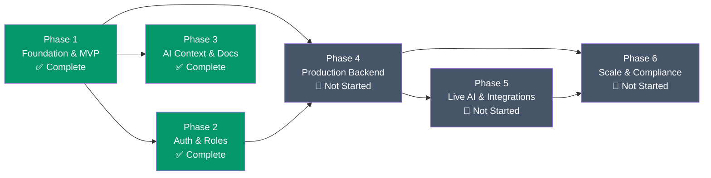

# AltMedi Development Phases

A structured, phased roadmap for evolving AltMedi from its current Nashik pilot MVP into a production-grade, nationally scalable medicine decision-support platform.

> [!NOTE]
> Each phase builds on the previous one. A phase is considered **complete** only when all its success criteria are met and verified. AI assistants should reference this file to understand what has been built, what is actively in progress, and what is next.

---

## Phase Overview

| Phase | Name | Status | Timeline | Focus |
| :--- | :--- | :--- | :--- | :--- |
| **Phase 1** | Foundation & MVP | ✅ Complete | Aug 2026 | Core architecture, comparison engine, and demo catalog |
| **Phase 2** | Authentication & Role System | ✅ Complete | Sep 2026 (Week 1) | Multi-role auth, session persistence, and ABHA/license capture |
| **Phase 3** | AI Context & Documentation | ✅ Complete | Sep 2026 (Week 1) | Persistent AI memory (`decisions.md`, `rules.md`, `memory.md`, `changelog.md`, `phases.md`) |
| **Phase 4** | Production Backend & Database | 🔄 In Progress | Sep–Oct 2026 | PostgreSQL, Prisma ORM, REST API, and data persistence |
| **Phase 5** | Live AI Pipeline & Integrations | 🔲 Not Started | Oct–Nov 2026 | Gemini 2.0 multimodal OCR, SMS/WhatsApp notifications, geocoding |
| **Phase 6** | Scale, Localization & Compliance | 🔲 Not Started | Dec 2026 – Q1 2027 | Multi-region expansion, Marathi/Hindi localization, ABDM certification |

---

## Phase 1: Foundation & MVP

**Status**: ✅ Complete  
**Timeline**: August 2026  
**Git Ref**: Commit `a800126` ("this is the first version")

### Objective
Build the full-spectrum clinical prototype demonstrating AltMedi's core value proposition: prescription scanning → medicine identification → bioequivalent alternatives → local pharmacy pricing → pharmacist verification — across both patient mobile and professional desktop experiences.

### Deliverables

#### 1.1 Dual-UX Architecture
- [x] Single-page React 19 + TypeScript + Vite application
- [x] Patient Mobile Container (`max-w-md`) with camera-first prescription workflow
- [x] Desktop Authoritative Portal (`max-w-7xl`) with role-tabbed professional workspace
- [x] Global header with runtime viewport toggle (`mobile` ↔ `desktop`)

#### 1.2 Prescription Camera & OCR Pipeline
- [x] `PrescriptionCamera.tsx` — Camera viewfinder with grid reticle and capture animation
- [x] Quick-sample prescription selectors (Antibiotic, Gastro, Pediatric)
- [x] `ExtractionReview.tsx` — Confidence-scored item review with ambiguity resolution
- [x] Simulated `parsePrescriptionImage()` returning structured `ExtractedPrescriptionItem[]`

#### 1.3 Medicine Comparison Engine
- [x] `MedicineComparisonView.tsx` — 1,640-line comprehensive comparison component
- [x] Two-tier alternative grouping: *Same Active Ingredient* vs *Therapeutic Alternative*
- [x] Savings calculator (percentage + absolute ₹ + annualized projections)
- [x] Active ingredient breakdown with molecule-level comparison
- [x] Local Nashik pharmacy stock indicators with freshness badges
- [x] Interactive reservation workflow with confirmation codes
- [x] Safety monograph: side effects, allergy cross-reactivity, contraindications
- [x] Dynamic filter bar (Same Generic Only, Price ↑, Distance ↑)

#### 1.4 Pharmacist Review Subsystem
- [x] `PharmacistReviewModal.tsx` — Patient-facing 1-click verification request
- [x] Pharmacist queue in Desktop Portal with clinical rationale recording
- [x] Immutable decision audit (`SUBSTITUTION_CONFIRMED` / `SUBSTITUTION_REJECTED`)

#### 1.5 Professional Desktop Portal
- [x] Pharmacist confirmation queue with tabular review and status badges
- [x] Doctor prescriber workspace with formulary search and guidelines
- [x] Vendor inventory & pricing editor with instant offer publishing
- [x] Super Admin mapping governance (approve / quarantine / deprecate)
- [x] Immutable audit log viewer with full event details

#### 1.6 Pre-Seeded Data Catalog
- [x] 10 canonical Indian medicines (Augmentin, Amoxyclav, Moxikind-CV, Zifi, Pan-D, Pantocid DSR, Calpol, Dolo, Telma, Telmikind)
- [x] 6 approved medicine mappings with clinical rationale
- [x] 9 vendor offers across 5 Nashik pharmacies
- [x] 3 pharmacist review tickets (pending, confirmed, rejected)
- [x] 3 seed audit events

#### 1.7 Type System & Service Layer
- [x] `src/types/index.ts` — 13 domain interfaces and union types
- [x] `src/services/api.ts` — `AltMediService` class with search, alternatives, reviews, and audit methods
- [x] `src/services/catalogData.ts` — Realistic pharmaceutical seed data

### Success Criteria
- [x] Full patient journey: scan prescription → review items → compare alternatives → check pharmacy stock → request pharmacist review
- [x] Full professional journey: pharmacist reviews queue → records decision → audit log updated
- [x] TypeScript compiles with zero errors (`tsc --noEmit`)

---

## Phase 2: Authentication & Role System

**Status**: ✅ Complete  
**Timeline**: September 8, 2026  
**Git Ref**: Commit `46c891d` ("added login and registration")

### Objective
Add production-grade, role-adaptive authentication that captures Indian healthcare identity credentials (ABHA, medical licenses, drug licenses) and supports instant demo switching across all 6 platform roles.

### Deliverables

#### 2.1 Auth Screen & Modal
- [x] `AuthScreen.tsx` — Unified login, registration, demo-switch, and guest mode
- [x] Role selector with contextual credential forms
- [x] Patient-specific fields: ABHA ID, known drug allergies checklist, Nashik locality
- [x] Doctor-specific fields: MMC/NMC registration number, medical speciality, hospital affiliation
- [x] Pharmacist-specific fields: State Pharmacy Council license, pharmacy name
- [x] Vendor-specific fields: Drug License (Form 20B/21B), pharmacy establishment
- [x] Password visibility toggle and form validation

#### 2.2 Session & Identity Service
- [x] `authService.ts` — `loginWithCredentials`, `loginWithDemoUser`, `registerNewUser`, `logoutUser`
- [x] LocalStorage session persistence (`altmedi_auth_session`)
- [x] 6 pre-seeded verified demo profiles (Patient, Pharmacist, Doctor, Vendor, Tenant Admin, Platform Admin)

#### 2.3 Header & App Integration
- [x] User chip in global header with name, role badge, and organization
- [x] Guest mode banner with sign-in / register CTA
- [x] Automatic desktop portal activation for professional roles
- [x] Session-aware sign-out flow resetting to guest state

### Success Criteria
- [x] Can log in as any of 6 demo roles and access role-appropriate views
- [x] Session persists across page reloads via `localStorage`
- [x] Custom registration captures role-specific credentials
- [x] Guest mode allows full read-only evaluation

---

## Phase 3: AI Context & Documentation

**Status**: ✅ Complete  
**Timeline**: September 8, 2026

### Objective
Create persistent AI context files that enable any AI coding assistant to understand the full project state, adhere to established conventions, and make informed decisions without re-analyzing the codebase from scratch.

### Deliverables

- [x] `decisions.md` — 8 Architectural Decision Records (DEC-001 through DEC-008)
- [x] `rules.md` — Coding standards, folder rules, naming conventions, UI/UX palette, git commit standards, and security mandates
- [x] `memory.md` — Project overview, tech stack, completed features, API endpoints, database schema (with ER diagram), business logic, known issues, and roadmap
- [x] `changelog.md` — Versioned history following Keep a Changelog standard
- [x] `phases.md` — This file; phased development roadmap with task checklists

### Success Criteria
- [x] AI assistant can answer "what does this project do?" solely from `memory.md`
- [x] AI assistant can answer "what patterns should I follow?" solely from `rules.md`
- [x] AI assistant can answer "why was this built this way?" solely from `decisions.md`
- [x] All files are clean GitHub Markdown with headings, tables, checklists, and code blocks

---

## Phase 4: Production Backend & Database

**Status**: 🔄 In Progress  
**Timeline**: September – October 2026  
**Depends on**: Phase 1, Phase 2

### Objective
Replace the in-memory `AltMediService` with a persistent PostgreSQL database, Prisma ORM schema, and a secure Express REST API. All data must survive server restarts, support concurrent multi-user access, and maintain full audit integrity.

### Deliverables

#### 4.1 Database Setup
- [ ] PostgreSQL instance (local Docker or Supabase hosted)
- [~] Prisma schema defining all 9 tables from `memory.md` database schema — added; migration and validation pending dependency install
- [ ] Initial seed migration with existing `catalogData.ts` data
- [ ] Row-level security policies scoped by `tenant_id`

#### 4.2 REST API Layer
- [ ] Express server with modular route controllers (`/api/v1/...`)
- [ ] 14 REST endpoints matching the contracts defined in `memory.md` Section 5.2
- [ ] JWT or session-based authentication middleware
- [ ] Rate limiting and input validation (Zod schemas)
- [ ] CORS configuration for local development and production origins

#### 4.3 Frontend API Migration
- [ ] Replace all `AltMediService` method calls with `fetch` / `axios` HTTP calls
- [ ] Add loading states, error boundaries, and retry logic to all data-dependent components
- [ ] Implement optimistic UI updates for vendor offer edits and pharmacist decisions

#### 4.4 Data Integrity
- [ ] Foreign key constraints across all relational tables
- [ ] Unique constraints on `users.email` and `medicine_entities.id`
- [ ] Audit events table is append-only (no `UPDATE` or `DELETE` permissions)
- [ ] Automated database backup schedule

### Success Criteria
- [ ] All existing features work identically but data persists across server restarts
- [ ] Creating a pharmacist review from the patient app appears in the pharmacist queue without page reload
- [ ] Vendor offer updates are immediately visible to patient search results
- [ ] Audit log entries are immutable and queryable by date range, actor, and entity type
- [ ] `npm run lint` continues to pass with zero errors

---

## Phase 5: Live AI Pipeline & Integrations

**Status**: 🔲 Not Started  
**Timeline**: October – November 2026  
**Depends on**: Phase 4

### Objective
Connect the prescription camera to Google's Gemini 2.0 Flash multimodal model for real handwriting OCR, integrate SMS/WhatsApp notification services for reservation confirmations, and add live geocoding for pharmacy distance calculations.

### Deliverables

#### 5.1 Gemini Multimodal OCR Pipeline
- [ ] Server-side endpoint `/api/v1/prescriptions/extract` accepting base64 image payloads
- [ ] Gemini 2.0 Flash prompt engineering for Indian prescription handwriting patterns
- [ ] Structured JSON output schema: medicine name, strength, dosage form, frequency, duration
- [ ] Confidence scoring with automatic ambiguity flagging below 0.85 threshold
- [ ] Entity resolution against the canonical `medicine_entities` table
- [ ] Fallback to manual text entry when Gemini confidence is below 0.60

#### 5.2 Notification Service
- [ ] SMS dispatch via Twilio or MSG91 for reservation confirmation codes
- [ ] WhatsApp Business API integration for pharmacist verification status updates
- [ ] Notification preference settings in user profile (opt-in/opt-out)
- [ ] Templated message library compliant with TRAI DND regulations

#### 5.3 Geocoding & Distance Matrix
- [ ] Google Maps Platform or Mapbox integration for pharmacy distance calculations
- [ ] Browser Geolocation API for patient's current position (with consent)
- [ ] Dynamic distance sorting replacing static pre-calculated values
- [ ] Interactive pharmacy map view as an alternative to list format

#### 5.4 Real-Time Stock Updates
- [ ] WebSocket or Server-Sent Events (SSE) for live vendor offer push updates
- [ ] Automatic offer freshness degradation cron job (mark stale at 7 days, expired at 14 days)
- [ ] Push notification to patient when a reserved medicine is confirmed available

### Success Criteria
- [ ] Photograph of a real handwritten Indian prescription produces correctly identified medicines with >85% accuracy
- [ ] Patient receives SMS confirmation within 30 seconds of reserving a medicine pack
- [ ] Pharmacy distances update dynamically based on the patient's actual GPS coordinates
- [ ] Vendor stock changes are reflected in patient-facing search within 5 seconds via WebSocket

---

## Phase 6: Scale, Localization & Compliance

**Status**: 🔲 Not Started  
**Timeline**: December 2026 – Q1 2027  
**Depends on**: Phase 4, Phase 5

### Objective
Expand AltMedi beyond the Nashik pilot to multiple Maharashtra districts, add Marathi and Hindi localization, achieve ABDM certification for digital health locker integration, and package the application for mobile distribution.

### Deliverables

#### 6.1 Multi-Region Tenant Expansion
- [ ] Onboarding workflow for new tenant networks (Pune, Mumbai, Nagpur)
- [ ] Tenant admin self-service dashboard for managing pharmacy partners, user invitations, and regional catalog extensions
- [ ] Regional drug pricing variance analytics per tenant
- [ ] Cross-tenant anonymized benchmarking reports for district health authorities

#### 6.2 Localization (i18n)
- [ ] `react-i18next` or equivalent i18n framework integration
- [ ] Full Marathi (मराठी) translation of all patient-facing UI strings
- [ ] Full Hindi (हिन्दी) translation of all patient-facing UI strings
- [ ] Language picker in header and persistent language preference per user
- [ ] Right-to-left (RTL) layout testing for Urdu if applicable in future

#### 6.3 ABDM Certification & Integration
- [ ] ABDM Milestone 1: Health Facility Registry (HFR) integration for verified pharmacy listing
- [ ] ABDM Milestone 2: Health Professional Registry (HPR) integration for doctor and pharmacist auto-verification
- [ ] ABDM Milestone 3: ABHA-based digital prescription pull (eliminating manual camera capture for digitized prescriptions)
- [ ] National Medical Register (NMR) API for real-time doctor license verification
- [ ] Compliance documentation for ABDM sandbox and production certification

#### 6.4 Jan Aushadhi & National Pricing API
- [ ] Integration with PMBJP (Pradhan Mantri Bhartiya Janaushadhi Pariyojana) national price database
- [ ] Automatic flagging of Jan Aushadhi equivalents in comparison results
- [ ] Government subsidy and scheme eligibility indicators for BPL patients

#### 6.5 Mobile App Packaging
- [ ] Progressive Web App (PWA) manifest with offline caching and home screen install
- [ ] Android APK distribution via React Native wrapper or Capacitor
- [ ] App store listing preparation (Google Play Store)
- [ ] Push notification integration (Firebase Cloud Messaging)

#### 6.6 Pharmacy POS Connectors
- [ ] CSV bulk upload adapter for offline pharmacy inventory updates
- [ ] API connector for Marg ERP (widely used Indian pharmacy management software)
- [ ] API connector for Retailio and Vyapar POS systems
- [ ] Automated daily stock sync scheduler

### Success Criteria
- [ ] At least 2 additional tenant networks onboarded beyond Nashik
- [ ] Patient mobile experience fully functional in Marathi
- [ ] ABDM sandbox certification obtained for Milestone 1 and 2
- [ ] Jan Aushadhi equivalents automatically surfaced with government pricing
- [ ] Android PWA installable from Google Play Store

---

## Phase Dependencies Graph

---

## How to Use This File

1. **Before starting any task**, check which phase and sub-task it belongs to.
2. **Mark tasks `[x]`** as you complete them and update the phase status.
3. **Do not skip phases**. Each phase's deliverables are prerequisites for subsequent phases.
4. **Update `changelog.md`** with a new version entry when a phase is completed.
5. **Update `decisions.md`** if a phase introduces a significant architectural decision.
6. **Update `memory.md`** when new features, APIs, or schema changes are finalized.
